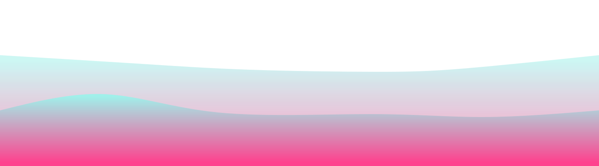

   

<h2 align="center"> Autodidata  e apaixonado por desenvolvimento! </h2> 

- 👨‍💻 Eu sou Alan Junqueira👋, um graduando em Ciência da Computação do Brasil.    

- 🌳 Estou atualmente me aprofundando em arquitetura de software!    

- 🾠Busco por network e novos amigos aqui!    

- 🌊 Objetivo de 2025: Aprender uma nova linguagem (GO), e desenvolver um projeto pessoal.    

- ☕ Interesses: Arquitetura, Inovação e Código.    

-  Hobbies: Me atualizar, Séries, Filmes.   

<h2></h2>

  
  

  <h2> <strong> ⚙️ Tecnologias e habilidades </strong></h2>
   

  
   

  
   

  <h2></h2>
  <h3> <strong> Linguagens, Frameworks e Ferramentas </strong></h3>
  
   
  <h2></h2>
  <h3> <strong> Aprendendo </strong></h3>
  
   

<h2></h2>

  <h2> 🆠Status do meu github </h2> 
    <h2></h2> 
  
  

  

 

<h2></h2>

  <h2 align="center">✉️ Contato </h2>
  
  &nbsp
  
  &nbsp
  
  &nbsp
  
  &nbsp
  

<!--  -->

